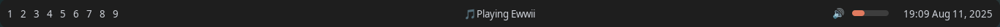

# Ewwii

Elkowars Wacky Widgets Imporved Interface is a fork of Elkowars Wacky Widgets which is a standalone widget system made in Rust that allows you to implement your own, custom widgets in any window manager.

## Examples

Examples of projects powered by ewwii.

| Project | Preview |
|---------|---------|
| **Basic Bar** [- View Example](./examples/ewwii-bar) |  |
| **Data Structures** [- View Example](./examples/data-structures) |  |
| **Wi-Fi GUI Template** [- View on GitHub](https://github.com/Ewwii-sh/ewifi_gui_template) |  |
| **Obsidian Bar Template** [- View on GitHub](https://github.com/Ewwii-sh/obsidian-bar) |  |
| **Binary Dots by [@BinaryHarbinger](https://github.com/BinaryHarbinger)** [- View on GitHub](https://github.com/BinaryHarbinger/binarydots/) | 
| **Astatine Dots (Linux Rice with Ewwii)** [- View on GitHub](https://github.com/Ewwii-sh/astatine-dots) |  |

## Contribewwtiing

If you want to contribute anything, like adding new widgets, features, or subcommands (including sample configs), you should definitely do so.

### Steps

1. Fork this repository
2. Read `CONTRIBUTING.md`
3. Install dependencies
4. Write down your changes in CHANGELOG.md
5. Open a pull request once you're finished

## Licensing

This project is a fork of [Eww](https://github.com/elkowar/eww) (MIT License).

-   Original Eww code remains under MIT License (see `licenses/eww-MIT.txt`).
-   Modifications and additions in this fork are licensed under GPL-3.0 (see `LICENSE`).

## Widget

https://en.wikipedia.org/wiki/Wikipedia:Widget
