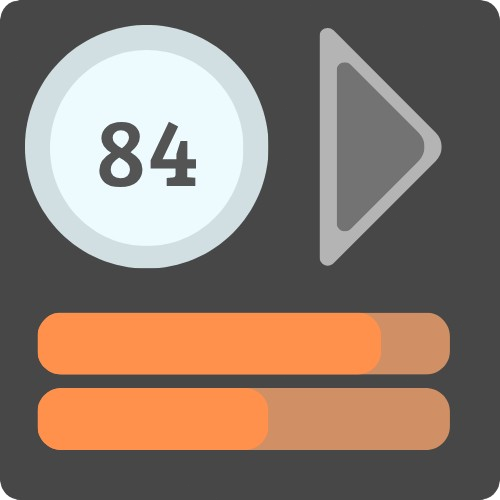
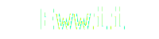
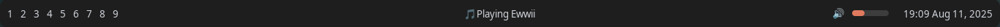

 

  
   
  
  
Building Widgets Made Better

  
  

 

Ewwii is a Gtk4 based widget system for Linux that lets you build fully custom desktop widgets using the [Rhai](https://rhai.rs) scripting language. It is a hard fork of [Eww](https://github.com/elkowar/eww), rewritten from the ground up to drop the Yuck/Simplexpr syntax in favor of a modular, programmable, expression-based configuration system.

## Features

- **Powered by Gtk4:** Hardware acceleration and better performance
- **Hot Reloading:** Quick development with instant feedback loop
- **Plugin System:** Extend or Replace core components via custom plugins
- **X11 + Wayland support:** Native support for both major display protocols

## Examples

Examples of projects powered by ewwii.

| Project | Preview |
|---------|---------|
| **Basic Bar** [- View Example](./examples/ewwii-bar) |  |
| **Data Structures** [- View Example](./examples/data-structures) |  |
| **Obsidian Bar Template** [- View on GitHub](https://github.com/Ewwii-sh/obsidian-bar) |  |
| **Binary Dots by [@BinaryHarbinger](https://github.com/BinaryHarbinger)** [- View on GitHub](https://github.com/BinaryHarbinger/binarydots/) | 
| **Astatine Dots (Linux Rice with Ewwii)** [- View on GitHub](https://github.com/Ewwii-sh/astatine-dots) |  |

## Contribewwtiing

If you want to contribute anything, like adding new widgets, features, or subcommands (including sample configs), you should definitely do so.

### Steps

1. Fork this repository
2. Read `CONTRIBUTING.md`
3. Install dependencies
4. Write down your changes in CHANGELOG.md
5. Open a pull request once you're finished

## Licensing

This project is a fork of [Eww](https://github.com/elkowar/eww) (MIT License).

-   Original Eww code remains under MIT License (see `licenses/eww-MIT.txt`).
-   Modifications and additions in this fork are licensed under GPL-3.0 (see `LICENSE`).

## Stars

If you find this project interesting, be sure to leave a star!

