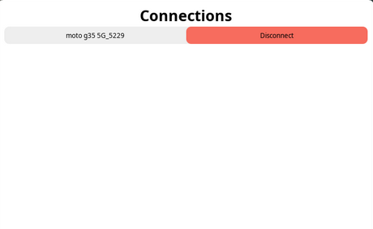

# Wifi Manager Template



An advanced ewwii template showcasing `api::wifi` module, manual `nm-cli` parsing, and advacned ewwii CLI commands. See the template at [Ewwii-sh/ewifi_gui_template](https://github.com/Ewwii-sh/ewifi_gui_template).

## Installing

This template is regestered in the [eii-manifests](https://github.com/Ewwii-sh/eii-manifests), so you can install it via [eiipm](https://ewwii-sh.github.io/docs/package-manager/overview/): ewwii's package manager.

Just run the following command and have the template ready in the current working directory!

```bash
eiipm i ewifi_gui_template
```
